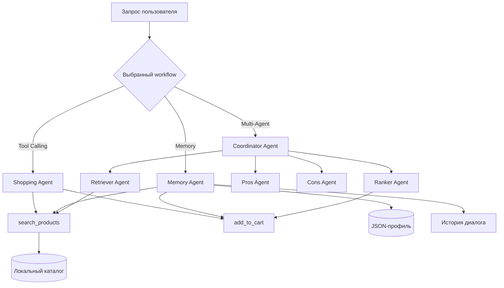

# Multi-Agent Shopping Assistant

[](https://www.python.org/)
[](https://jupyter.org/)
[](https://python.langchain.com/)
[](https://yandex.cloud/ru/services/foundation-models)
[](LICENSE)

**Multi-Agent Shopping Assistant** — интеллектуальный помощник для поиска и выбора товаров. Система демонстрирует три уровня агентной архитектуры: базовый агент с вызовом инструментов, агент с краткосрочной и долговременной памятью, а также мультиагентный пайплайн для формирования рекомендаций.

Ассистент работает с локальным каталогом товаров, учитывает категорию, бренд, бюджет и рейтинг, сохраняет предпочтения пользователя и при необходимости добавляет выбранный товар в корзину. Весь код, примеры запуска и проверки находятся в Jupyter Notebook.

---

## 🏗 Архитектура системы



### 📂 Структура репозитория

```text
├── submission.ipynb   # Реализация агентов, инструментов и демонстрационных сценариев
├── pyproject.toml     # Метаданные проекта и Python-зависимости
├── example.env        # Шаблон переменных окружения Yandex Cloud
├── AGENTS.md          # Руководство для участников проекта
├── LICENSE            # Лицензия MIT
└── README.md          # Документация проекта
```

Во время работы агент памяти создает локальные JSON-файлы с профилем пользователя. Они, как и каталог `data/`, исключены из Git.

---

## 🛠 Технологический стек

- **Python 3.11+** — основная логика, модели состояния и оркестрация.
- **Jupyter Notebook** — интерактивный запуск сценариев и проверок.
- **LangChain Core** — типы сообщений и преобразование Python-функций в tool schemas.
- **langchain-openai** — OpenAI-совместимый клиент `ChatOpenAI`.
- **Yandex Cloud Foundation Models** — LLM через endpoint `https://ai.api.cloud.yandex.net/v1`.
- **python-dotenv** — загрузка учетных данных из локального env-файла.

---

## 🚀 Быстрая установка и запуск

### 1. Клонирование и виртуальное окружение

```bash
git clone https://github.com/nikzhilin/Multi-Agent-Shopping-Assistant.git
cd Multi-Agent-Shopping-Assistant

python -m venv .venv
source .venv/bin/activate
python -m pip install -e .
```

Для Windows PowerShell активация окружения выполняется командой:

```powershell
.\.venv\Scripts\Activate.ps1
```

### 2. Настройка Yandex Cloud

Создайте локальный файл с переменными окружения:

```bash
cp example.env .env
```

Заполните значения:

```env
YANDEX_CLOUD_FOLDER=your_folder_id
YANDEX_CLOUD_API_KEY=your_api_key
```

Перед запуском экспортируйте их в текущую сессию:

```bash
set -a
source .env
set +a
```

> В первой ячейке notebook используется `load_dotenv("MY_KEY.env")`. Переменные из окружения имеют тот же эффект. Альтернативный вариант — заменить этот вызов на `load_dotenv()` для прямого чтения `.env`.

### 3. Запуск notebook

```bash
jupyter notebook submission.ipynb
```

Выполняйте ячейки последовательно сверху вниз. Для работы LLM необходимы действующие учетные данные и доступ к Yandex Cloud API.

---

## 🧩 Сценарии работы

### 1. Tool-Calling Shopping Agent

Функция `run_shopping_agent(...)` реализует итеративный цикл вызова LLM и инструментов:

1. Модель анализирует запрос и формирует tool call.
2. `search_products` фильтрует локальный каталог по тексту, категории, бренду и цене.
3. `add_to_cart` изменяет состояние корзины.
4. Результат инструмента возвращается модели через `ToolMessage`.
5. Цикл продолжается до получения итогового текстового ответа.

Пример:

```text
Find a wireless mouse under 120 dollars and add the cheapest one to cart
```

### 2. Агент с памятью

`run_memory_agent(...)` дополняет базовый workflow двумя видами памяти:

- **краткосрочная** — история `HumanMessage`, `AIMessage` и `ToolMessage` между репликами;
- **долговременная** — JSON-профиль с именем, брендом, бюджетом, цветом и категорией.

Инструмент `update_profile` сохраняет новые предпочтения, а `load_profile` загружает их в следующей сессии.

```text
My name is Anna, I prefer Sony and my budget is 200 dollars
```

### 3. Мультиагентная рекомендация

`CoordinatorAgent` последовательно делегирует задачу специализированным компонентам:

| Агент | Ответственность |
|---|---|
| `RetrieverAgent` | Находит до пяти релевантных товаров и извлекает бюджет |
| `ProsAgent` | Формирует преимущества каждого кандидата по данным каталога |
| `ConsAgent` | Описывает ограничения и недостатки кандидатов |
| `RankerAgent` | Выбирает максимальный рейтинг; при равенстве — меньшую цену |
| `CoordinatorAgent` | Управляет этапами, собирает ответ и обновляет корзину |

Общий контекст передается через `AgentContext`, а последовательность делегирования сохраняется в `trace`.

---

## 🔧 Доступные инструменты

### `search_products`

Поддерживает параметры:

| Параметр | Назначение |
|---|---|
| `query` | Поиск по названию, категории, бренду и тегам |
| `category` | Точное ограничение по категории |
| `brand` | Регистронезависимый фильтр бренда |
| `max_price` | Максимальная допустимая цена |
| `sort_by` | `price_asc` или `rating_desc` |

### `add_to_cart`

Добавляет товар по `product_id`, увеличивает количество уже добавленной позиции и возвращает статус операции.

### `update_profile`

Сохраняет пару `key` / `value` в JSON-профиль пользователя. Рекомендуемые ключи: `name`, `brand`, `max_price`, `color`, `category`.

---

## ✅ Проверка работы

В нижней части `submission.ipynb` находятся исполняемые сценарии с `assert`:

- фильтрация товаров по цене;
- поиск и добавление самой дешевой позиции;
- сохранение и повторное использование профиля;
- перенос контекста между репликами;
- полный цикл `search → pros → cons → rank → cart`;
- соблюдение бюджета и разрешение равного рейтинга по цене.

Notebook можно выполнить целиком без перезаписи исходного файла:

```bash
jupyter nbconvert --execute --to notebook submission.ipynb \
  --output /tmp/submission.executed.ipynb
```

---

## 📜 Лицензия

Проект распространяется по лицензии **MIT**. Подробности приведены в файле [LICENSE](LICENSE).
